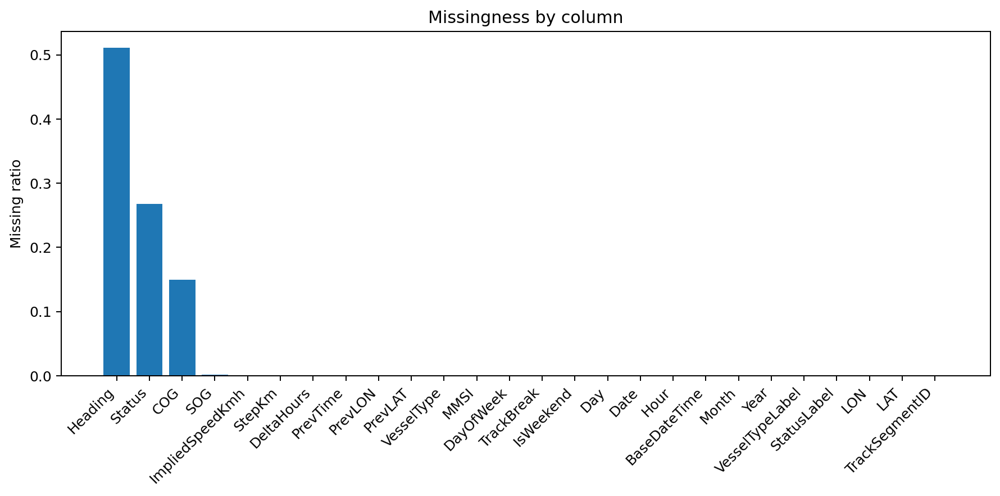
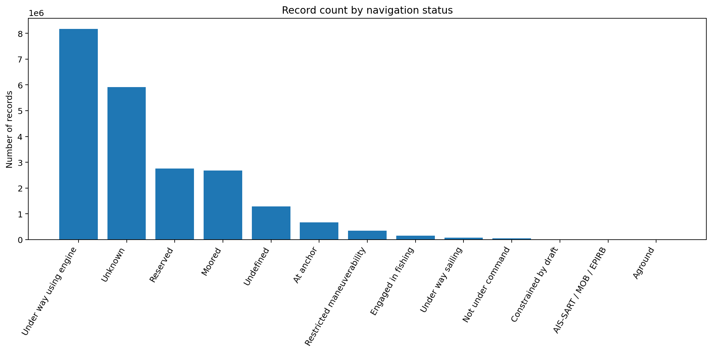
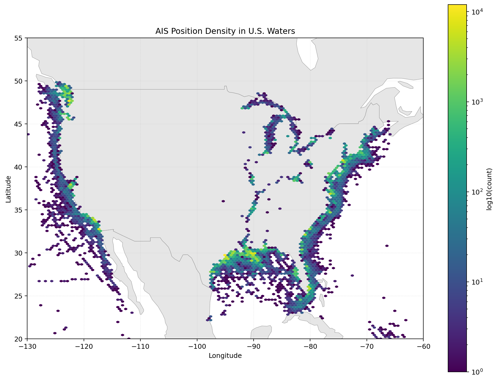
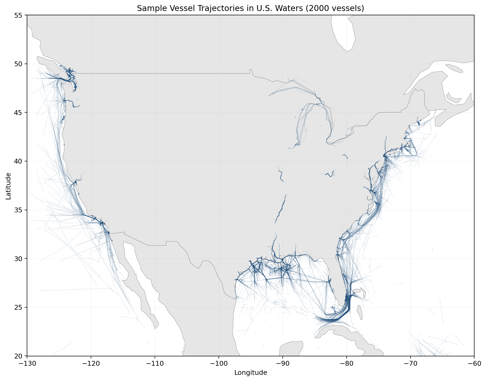

# Project of Data Visualization (COM-480)

| Student's name | SCIPER |
| -------------- | ------ |
| | |
| Siyuan Zhang | 388143 |
| Dmitry Teploukhov | 339647 |

[Milestone 1](#milestone-1) • [Milestone 2](#milestone-2) • [Milestone 3](#milestone-3)

## Milestone 1 (20th March, 5pm)

**10% of the final grade**

This is a preliminary milestone to let you set up goals for your final project and assess the feasibility of your ideas.
Please, fill the following sections about your project.

*(max. 2000 characters per section)*

### Dataset

> Find a dataset (or multiple) that you will explore. Assess the quality of the data it contains and how much preprocessing / data-cleaning it will require before tackling visualization. We recommend using a standard dataset as this course is not about scraping nor data processing.
>
> Hint: some good pointers for finding quality publicly available datasets ([Google dataset search](https://datasetsearch.research.google.com/), [Kaggle](https://www.kaggle.com/datasets), [OpenSwissData](https://opendata.swiss/en/), [SNAP](https://snap.stanford.edu/data/) and [FiveThirtyEight](https://data.fivethirtyeight.com/)).

Our project uses the US Coast Guard + NOAA AIS Datasets. AIS data consists of vessel traffic records transmitted through the Automatic Identification System, by which vessels continuously broadcast their identity, position, and navigational status while underway. The AIS data we use originates from the US Coast Guard's Nationwide Automatic Identification System (NAIS) land-based receiving network and is released by NOAA/BOEM through Marine Cadastre.

These datasets primarily covers the continental United States, Alaska, Hawaii, Guam, and parts of the Caribbean. It does not cover ocean areas 40–50 miles from the coast or foreign waters. Therefore, our research focuses primarily on US coastal and inland waterway shipping, rather than the vessel activity on the high seas.

We access the data through Kaggle, which hosts annual U.S. Coast Guard + NOAA AIS datasets from 2011 to 2024. We will select several years' data from these datasets for our research. 

We use the 2024 dataset [https://www.kaggle.com/datasets/bwandowando/2024-us-coast-guard-noaa-ais-dataset](https://www.kaggle.com/datasets/bwandowando/2024-us-coast-guard-noaa-ais-datas) as an example to demonstrate the dataset format. This dataset consists of 12 subsets, each corresponding to AIS data for one month. Each subset consists of two tables: the ship's dynamic position data logs (e.g., the 2024_NOAA_AIS_logs_01.parquet file) and the ship's static identity data (e.g., the 2024_NOAA_AIS_ships_01.parquet file). There are a total of 17 available attributes in the two tables: MMSI、BaseDateTime、LAT、LON、SOG、COG、Heading、Status、VesselName、IMO、CallSign、VesselType、Length、Width、Draft、Cargo、TransceiverClass. In general, AIS data format is standardized and of good quality, but some data preprocessing and analysis are still required for higher usability. For specific steps, please refer to the EDA section.

### Problematic

> Frame the general topic of your visualization and the main axis that you want to develop.
> - What am I trying to show with my visualization?
> - Think of an overview for the project, your motivation, and the target audience.

**How can interactive visualization of AIS vessel data reveal the dynamics of selected major U.S. ports in 2024 through route structure, temporal activity rhythms, and waiting or anchoring behavior around port areas?**

This project explores the 2024 U.S. Coast Guard / NOAA AIS dataset through an interactive web visualization centered on a selected set of major U.S. ports. Rather than simply displaying ship trajectories, we aim to represent ports as dynamic mobility systems. The visualization will combine route patterns, temporal activity views, and spatial distributions of waiting or anchoring behavior in order to show how vessel traffic is organized around ports and how these dynamics differ from one location to another.

Our goal is to show that ports are not just fixed points on a map, but places with distinct movement signatures. By combining where ships move, when activity intensifies, and where vessels slow down or remain stationary, we hope to make complex AIS data more readable and reveal operational patterns that are not immediately visible in raw trajectory records. The project is intended for students and instructors in data visualization, as well as for a broader audience interested in maritime traffic, transportation systems, and coastal activity.
### Exploratory Data Analysis

> Pre-processing of the data set you chose
> - Show some basic statistics and get insights about the data

Due to the sheer size of the dataset, for better reproducibility, we extract 10% of the data from Jan 2024 to present EDA results. Preprocessing includes loading data, converting data types and performing basic data cleaning to obtain complete records. We also perform some feature engineering to: 1) map the feature codes in the AIS data to readable fields, primarily targeting the VesselType and Status columns; 2) extract records for each ship from the raw data and sort them by time to attempt to reconstruct the navigation trajectory for each ship. Some results are as follows:

1. Basic Statistics: Overall, the data records have almost no duplicate records or outliers. The missing data rates for columns other than Heading, Status, COG, and SOG are almost zero. It is noted that the columns containing missing data all record the ship status information during navigation. We speculate that this is related to the limited AIS functionality used by some ships. Regarding the status of the vessels, it can be observed that there are far more vessels Under Way than those in Moored/At Anchor condition. More EDA results can be obtained in milestone1.ipynb.

  
  

2. Spatial Mapping of Coordinates and Trajectories: We map the coordinates and recovered trajectories of some selected ships to their corresponding geographical locations, resulting in the two maps shown below. It's noteworthy that almost all records are distributed along the coast, the Great Lakes region, and the Mississippi River basin. Furthermore, the data shows higher density near major port cities such as Seattle, New York, and New Orleans, demonstrating the high reliability of the AIS data. Several interesting preliminary findings emerge. One example is that (at least within the selected timeframe), the ship density and number of routes on the US West Coast are generally lower than those on the East Coast and the Gulf Coast. This may be related to industrial structure, geographical characteristics, etc., which we will continue to analyze in subsequent work.

  
  

### Related work

> - What others have already done with the data?
> - Why is your approach original?
> - What source of inspiration do you take? Visualizations that you found on other websites or magazines (might be unrelated to your data).
> - In case you are using a dataset that you have already explored in another context (ML or ADA course, semester project...), you are required to share the report of that work to outline the differences with the submission for this class.

Existing work on AIS data already includes several well-established directions. NOAA’s AccessAIS tool provides interactive access to U.S. vessel traffic data and quick visualizations of traffic density and vessel counts. The OECD AIS Tracking Dashboard focuses on higher-level indicators such as port congestion and maritime trade flows. In parallel, academic work on AIS frequently studies vessel trajectories through clustering, behavior analysis, and route extraction. Our project does not aim to reproduce a generic ship-tracking map or a purely operational dashboard. Instead, we propose a focused interactive visualization of selected U.S. ports in 2024 that combines route structure, temporal port rhythms, and waiting or anchoring behavior. This comparative and exploratory angle is more centered on making port dynamics understandable to a broad audience than on providing raw traffic monitoring or predictive analytics.

Representative examples include:
- [NOAA AccessAIS](https://coast.noaa.gov/digitalcoast/tools/ais.html) — existing public U.S. vessel traffic visualization tool.

- [OECD AIS Tracking Dashboard](https://www.oecd.org/en/data/dashboards/monitoring-maritime-trade-the-oecd-ais-vessel-tracking-dashboard.html) — example of port/trade/congestion dashboard.

- [Visual Analysis of Vessel Behaviour Based on Trajectory Data](https://www.mdpi.com/2220-9964/11/4/244) — example of academic AIS behavior/trajectory analysis.

## Milestone 2 (17th April, 5pm)

**10% of the final grade**

## Milestone 3 (29th May, 5pm)

**80% of the final grade**

## Late policy

- < 24h: 80% of the grade for the milestone
- < 48h: 70% of the grade for the milestone

